# Store Item Demand Forecasting

# 1. Project description
- In this project, I performed time series forecasting using LightGBM. I predicted sales for 50 items across 10 different stores for a three-month period. The data covers 5 years (from 2013-01-01 to 2017-12-31) of sales.
- By utilizing techniques such as time series decomposition (trend, seasonal, cyclical and residual components), time series feature engineering (creating date-related features, lag features, rolling window features and exponentially weighted features), time series train-test-split (chronological) and time series cross validation (rolling/expanding window), I was able to build a model capable of accurately forecasting sales for the next 3 months.
- A financial result was provided. The next 3 month sales were presented per store, per store and item, and for the total company considering the error and the forecasted sales sum, average, and best and worst scenarios. The company will sell 2,558,788.02 items in the next 3 months. Particularly, stores 2, 3 and 8 will sell more products, while stores 5, 6 and 7 will sell less products in this period. Finally, items 15 and 28 will be the most sold ones while item 5 will be the less sold one. The historical patterns found on eda will be preserved, illustrating how seasonality, trend and residual components are important for the forecast.
- The project follows a real data science workflow (based on CRISP-DM framework), encompassing tasks from data collection and exploratory data analysis (EDA) to final modeling. It includes features like exception handling, virtual environments, modular coding, code versioning (using Git and Github), and specifying requirements. By structuring it this way, I've organized the entire project as a package, making it easily reproducible by others.

# 2. Technologies and tools
The technologies and tools used were Python (Pandas, Numpy, Matplotlib, Seaborn, Scikit-Learn, Statsmodels, Optuna), Jupyter Notebook, Git and Github (version control), machine learning regression algorithms, statistics, Anaconda (terminal and virtual environment) and Visual Studio Code (project development environment).

# 3. Project structure
Each folder/file content and purpose is described below:

- Input: Stores all the input data used in the project.
- Models: Stores all the constructed models saved into pkl files.
- Notebooks: Contains exploratory data analysis and modelling jupyter notebooks.
- Reports: Stores all the images used for project documentation.
- Src: Contains all the scripts used in the project - artifacts_utils.py, modelling_utils.py and exception.py.
- Requirements, setup, gitignore, readme: The file setup.py allows me to build my entire project as a package, containing metadata and so on. Moreover, requirements.txt list all the dependencies needed for the project with the specific versions for reproducibility. Gitignore allows me to hide irrelevant information from commits and I am using readme.md for documentation and storytelling.

# 4. Business problem and project objectives
A retail store manager is strategizing to manage inventory and investments across 10 stores for 50 products, aiming to meet customer demand effectively. By employing predictive analytics, they aim to improve sales predictions, maintain product availability, and boost overall store performance.

Considering this, the project objectives are:
1. Identify valuable business insights about sales over time, like seasonal patterns, trends and general characteristics.
2. Construct a model able to accurately predict the sales for 50 items across 10 stores over a three-month period.
3. Determine financial results given by the project.

The project's financial outcomes will enable the manager to effectively oversee inventory and plan investments for growth, ensuring they meet customer demand and enhance overall store performance.

As a result, the business problem will be resolved.

# 5. Solution pipeline
The following pipeline was used, based on CRISP-DM framework

1. Business understanding.
2. Data understanding.
3. Data preparation.
4. Modelling.
5. Evaluation.
6. Deployment.

Each of these steps is approached in detail inside the notebooks.

CRISP-DM framework

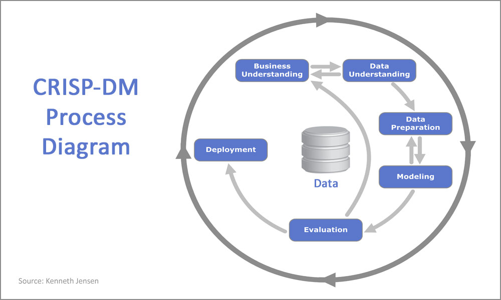

# 6. Main business insights
1. The sales present and increasing trend over the years. Seasonality is also present, the sales are higher around july.

Sales over the time

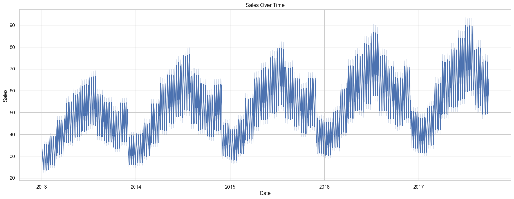

2. The sales tend to increase throughout the week. Sunday presents the highest sales volume.

Sales over the week

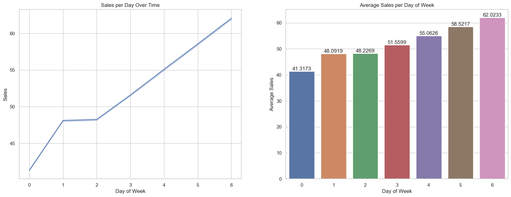

3. Stores 2 and 8 are the best ones. They tend to make more sales than the others. Stores 5, 6 and 7 are the worst ones.

Sales distribution per store

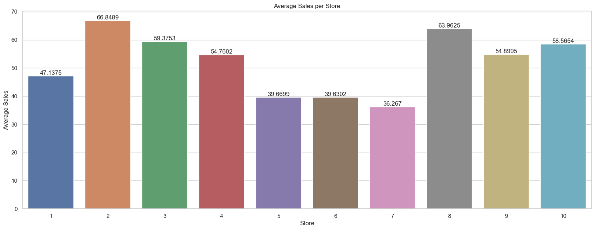

4. Items 28 and 15 tend to be the most sold ones.

Sales distribution per item

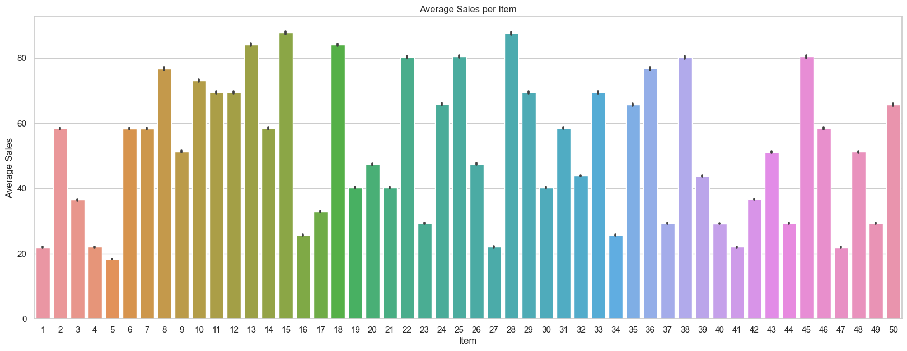

# 7. Modelling
1. Initially, having the data sorted by date, store and item, I did a time series train-test-split (in chronological order, ensuring that the model is trained with past data points and predicts on future data points). Once the objective was to forecast 3 months of sales, I separated 3 months for test. Finally, I did this at the beginning of the project to isolate test set, using it just for final model evaluation, simulating a real life production environment.

Time series train-test-split visualization

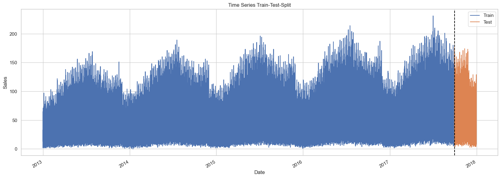

2. Then, I broke the time series into its trend, seasonal, cyclical and residual components using statsmodels in order to discover underlying patterns. It was possible to observe that the series is not stationary, presents an increasing trend and has residuals distributed around zero. This was useful for the feature engineering step.

Time series decomposition

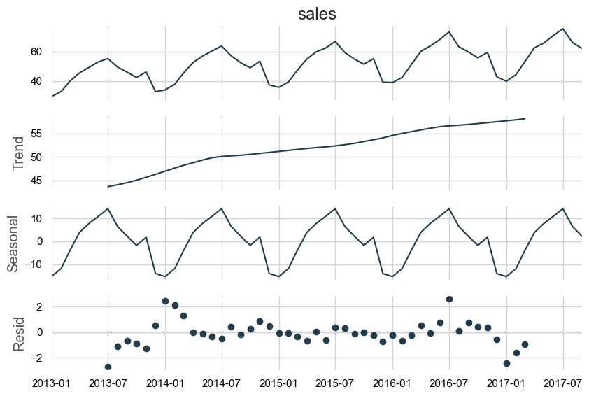

3. I implemented a time series cross validation using sklearn TimeSeriesSplit in order to compare different models trained on different data preparation/modelling approaches. Considering that we wanted to forecast 3 months of sales, I defined a 3 month test size, with a one week gap between train and test to avoid overfitting. By doing this, it was possible to obtain a more reliable performance estimate and isolate test set. 

Time series cross validation visualization

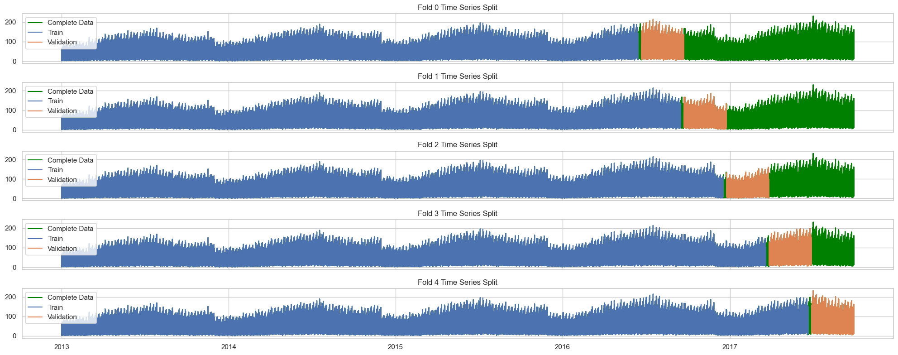

4. I chose LightGBM for modelling because I was focusing on the predictive power. Moreover, LightGBM is fast to train, and offers some data preparation advantages, such as dealing with missing values (the lag features, rolling window features and exponentially moving averages added a lot of missings) and non-sensitivity to scaling. Finally, it is capable of detecting nonlinear complex relationships in the data, as opposed to Linear Regression, for example.
5. For the data preparation step, I compared different approaches, starting from simpler to more complex ones, assessing the model's performance using time series cross validation to observe the effects of these approaches. CRISP-DM data preparation/modelling cycles were done here. I enumerated them for a good understanding.
6. A lot of time series features were created, such as date-related features, lag features, rolling window features and exponentially weighted mean features. The windows and lags were selected based on factors like seasonality and trend. Moreover, I applied a log-transformation to the target variable because it was significantly right-skewed. By doing this, its distribution turned more symmetric and the model was able to better capture the patterns behind the data.

Sales distribution before and after log-transformation

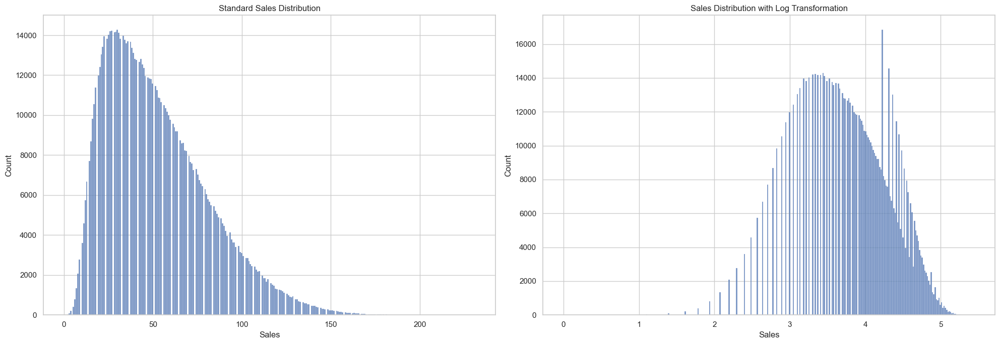

7. After obtaining my prepared data from data preparation/modelling CRISP-DM cycles, and verifying that machine learning was suitable for the problem by comparing it with an average model, I procceeded to feature selection and hyperparameter tuning.

8. I applied feature selection with the Recursive Feature Elimination (RFE) technique (along with time series cross validation), which recursively select a subset of features with highest feature importances until the desired number of features is reached. As a result, 31 of the 85 variables were selected, including a lot of variables created in feature engineering step, ilustrating the importance of this task.

9. I tuned the LightGBM model using bayesian search (along with time series cross validation) because it uses probabilistic models to intelligently explore the hyperparameter space, balancing exploration and exploitation. Optuna package was used, searching the best values of learning_rate, num_leaves, subsample, colsample_bytree and min_data_in_leaf. An observation here is that, once forecasting 3 months of sales is a low latency task, a higher number of estimators could be defined, like 5,000. However, I used just 1,000 due to computational limitations. 

9. Once I had my final tuned model, I evaluated its results obtaining regression metrics, observing actual vs predicted values and residual plots. The mean absolute error (MAE) told us that our model's predictions, on average, are off by approximately 6.1 units of the target variable (sales). This is excellent, considering that the sales range from 0 to 231, with an average value of 52.25. Also, the residuals are normally distributed around 0, and thus this Linear Regression assumption is verified, reinforcing the estimator's quality. An observation here is that I verified that lightgbm tends to make more significant errors when predicting higher sales values. This makes sense, as a rapid increase in sales can be challenging for it to capture. Finally, the train, validation and test RMSE scores were compared and they are very similar, validating that the model was not overfitting the training data and thus, will generalize well for new unseen instances.

LightGBM final model results

|        | Model    | MAE     | MAPE    | RMSE   | R2     |
|--------|----------|---------|---------|--------|--------|
| Results| LightGBM | 6.0979  | 13.2891 | 7.9741 | 0.9221 |

Some random actual vs predicted value

| Date       | Actual | Prediction | Residual |
|------------|--------|------------|----------|
| 2017-10-14 | 100.0  | 92.34      | 7.66     |
| 2017-12-13 | 17.0   | 19.37      | 2.37     |
| 2017-11-11 | 50.0   | 61.96      | 11.96    |
| 2017-11-28 | 56.0   | 47.58      | 8.42     |
| 2017-11-04 | 31.0   | 32.16      | 1.16     |
| 2017-11-11 | 40.0   | 40.47      | 0.47     |
| 2017-11-09 | 101.0  | 96.19      | 4.81     |
| 2017-11-06 | 16.0   | 15.75      | 0.25     |
| 2017-12-14 | 50.0   | 51.88      | 1.88     |
| 2017-10-10 | 34.0   | 38.12      | 4.12     |

Actual vs predicted values over the 3-month period

Residual plot

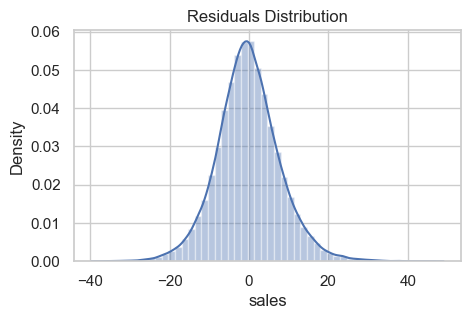

Actual vs predicted values plot

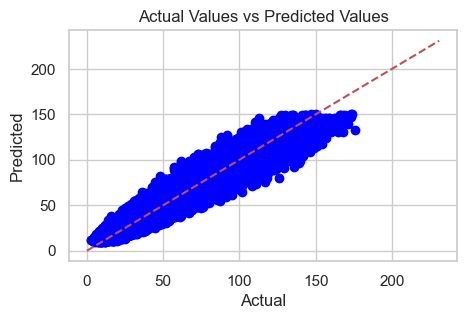

10. Then, I interpreted the model's results through SHAP values and LightGBM feature importances. Month, dayofweek, item and dayofyear are some of the most determinant features. This makes sense, since we have seasonality, with sales being higher in july and on sundays and items that are sold more or less. Two year, one year and a half and one year rolling mean features and exponentially weighted mean features presented a high predictive power! This ilustrates the importance of time series feature engineering when building a machine learning model for forecasting. Some rolling standard deviation variables were also significantly important, like sales_roll_std_365

LightGBM feature importances 

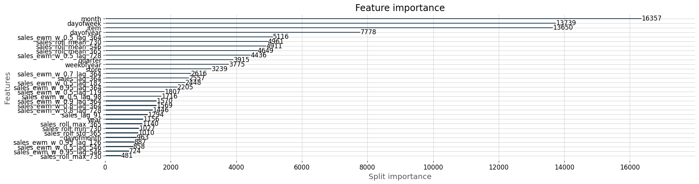

# 8. Financial result
A financial result was provided. The next 3 month sales were presented per store, per store and item, and for the total company considering the error and the forecasted sales sum, average, and best and worst scenarios. The company will sell 2,559,998 items in the next 3 months. Particularly, stores 2, 3 and 8 will sell more products, while stores 5, 6 and 7 will sell less products in this period. Finally, items 15 and 28 will be the most sold ones while item 5 will be the less sold one. The historical patterns found on eda will be preserved, illustrating how seasonality, trend and residual components are important for the forecast.

Financial result per store

| Store | Total predicted sales | Average predicted sales (daily) | Daily MAE | Worst average sales scenario (daily) | Best average sales scenario (daily) | Worst total sales scenario | Best total sales scenario |
|-------|-----------------------|---------------------------------|-----------|--------------------------------------|------------------------------------|-----------------------------|---------------------------|
| 1     | 232105                | 2496                            | 56        | 2440                                 | 2552                               | 226910                      | 237299                    |
| 2     | 326805                | 3514                            | 70        | 3444                                 | 3584                               | 320337                      | 333274                    |
| 3     | 290955                | 3129                            | 65        | 3064                                 | 3193                               | 284937                      | 296974                    |
| 4     | 269450                | 2897                            | 62        | 2836                                 | 2959                               | 263715                      | 275186                    |
| 5     | 195448                | 2102                            | 54        | 2048                                 | 2156                               | 190434                      | 200463                    |
| 6     | 194993                | 2097                            | 50        | 2046                                 | 2147                               | 190302                      | 199684                    |
| 7     | 178348                | 1918                            | 43        | 1874                                 | 1961                               | 174320                      | 182377                    |
| 8     | 313747                | 3374                            | 62        | 3311                                 | 3436                               | 307954                      | 319540                    |
| 9     | 270084                | 2904                            | 66        | 2838                                 | 2970                               | 263922                      | 276247                    |
| 10    | 288062                | 3097                            | 71        | 3027                                 | 3168                               | 281491                      | 294632                    |

Interpretation: Store 2 is expected to sell 326,805 items over the next 3 months, averaging about 3,514 items per day. With some possible errors, this number might change by around 70 items. So, on bad days, it might sell 3,444 items, and on good days, it might sell 3,583 items. In total, over the 3 months, it could sell between 320,337 and 333,273 items, depending on how sales go.

Total financial result

| Overall total predicted sales | Overall average predicted sales (daily) | Overall daily MAE | Overall worst average sales scenario (daily) | Overall best average sales scenario (daily) | Overall worst total sales scenario | Overall best total sales scenario |
|-------------------------------|-----------------------------------------|-------------------|---------------------------------------------|-------------------------------------------|------------------------------------|----------------------------------|
| 2559998                       | 27527                                   | 404               | 27123                                       | 27931                                     | 2522455                            | 2597542                          |

Interpretation: The company is expected to sell a total of 2,559,998 items over the next 3 months, averaging about 27,527 items per day. With some possible errors, this number might change by around 404 items. So, on bad days, it might sell 27,123 items, and on good days, it might sell 27,931 items. In total, over the 3 months, it could sell between 2,522,455 and 2,597,542, depending on how sales go.

# 9. Run this project on your local machine
To run the notebooks locally, make sure to have installed:

1. Python 3.11.4
2. pip (Python package manager)
3. Git (Version control tool)
4. Jupyter (Run the notebooks)

Once you have this installed, open a terminal on your local machine and run the following commands:

1. Clone the repository:
<pre>
git clone https://github.com/allmeidaapedro/Store-Item-Demand-Forecasting.git
</pre>

2. Navigate to the cloned repository directory:
<pre>
cd Store-Item-Demand-Forecasting
</pre>

3. Create a virtual environment:
<pre>
python -m venv venv
</pre>

4. Activate the Virtual Environment:

Activate the virtual environment used to isolate the project dependencies.
<pre>
source venv/bin/activate  # On Windows, use 'venv\Scripts\activate'
</pre>

5. Install Dependencies:

Use pip to install the required dependencies listed in the requirements.txt file.
<pre>
pip install -r requirements.txt
</pre>

6. Start Jupyter Notebook:

To start Jupyter Notebook, run the following command:
<pre>
jupyter notebook
</pre>
This will open a new tab or window in your web browser with the Jupyter Notebook interface.

7. Navigate to the 'notebooks' folder:

Use the Jupyter Notebook interface to navigate to the 'notebooks' folder within your project directory.

8. Open and Run Notebooks:

You should see the 'eda.ipynb' and 'modelling.ipynb' notebooks listed. Click on the notebook you want to run to open it. Once it's open, you can run individual cells or the entire notebook by clicking the "Run" button.

9. Deactivate the Virtual Environment (Optional):

When you're done working with the notebooks and want to exit the virtual environment, you can deactivate it using the following command:

<pre>
deactivate
</pre>

# 10. Dataset link
The dataset was collected from kaggle
Link: https://www.kaggle.com/competitions/demand-forecasting-kernels-only/overview

# 11. Contact me
Linkedin: https://www.linkedin.com/in/pedro-almeida-ds/

Github: https://github.com/allmeidaapedro

Gmail: pedrooalmeida.net@gmail.com
